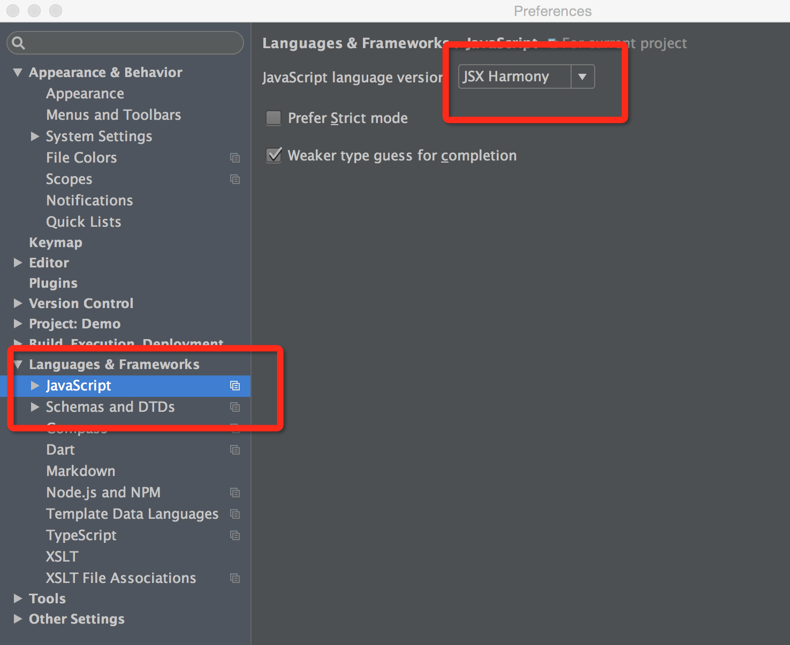
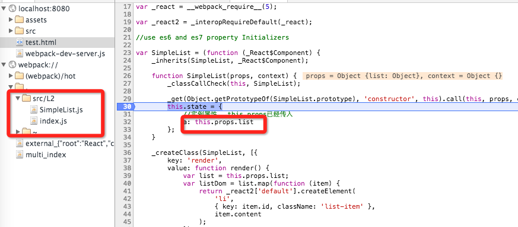

#一.环境配置与热身。

`首先是装逼环节`：为毛最近才开始看react。因为在写[这个](http://dapigu.wallstcn.com/test_resize.html),暂时还不支持`移动端`事件，可以响应鼠标滚动和拖拽。项目是准备[开源的](https://github.com/jzlxiaohei/FCharts),但是可以很负责的说，项目面临若干次的大规模重构，甚至项目名都要改，因为安装团队的习惯，项目名一般为女优的名字（-_—!）

但是react native android都出来了，不研究react岂不被淘汰了。所以最近都在看`react`和`redux`。

看的过程中，越来越发现，有很多思想可以借鉴到上面的k线程序中。所以觉得写一系列文章，让自己对这些思想加深印象。也给团队中不太懂`react`同学，一个教程。

本教程`目标`：理解react，写一个简化版的`redux`(`react-redux`)。另外本人也是边写边理解，如果有错误的地方，主动承认错误，尽量保留错误原文，并对正确的说法进行说明。展示自己傻逼的过程，也是一种进步。

本教程`风格`：将更多的给出已有教程的链接。别人已经写的很清楚了，我也就不废话了。但是看这些教程的一个问题，就是实例代码很难运行，或者代码太多，揉进去太多知识点，一时理不清楚。所以这里尽可能地做到，代码可运行，尽量简单。

本教程`假设`：具备react的基础知识。起码写过生成列表的react程序。如果不具备，网上各种react入门教程等着你。 如果有webpack的相关基础更好。没有也可以直接用，但是最好边用边学。能`google`

##环境配置

直接clone [项目吧](https://github.com/jzlxiaohei/react-lesson)

首先`npm install`

###主要的`dependencies`

（有多余）基本分为：

1. react相关
2. webpack 相关（包括webpack-dev-server,各种loader）
3. gulp 相关。gulp用做任务管理。
4. babel相关
5. 其他小东西

### IDE设置
本人是用`webstorm 10.0.2`,开发react时候，修改一下js引擎版本，就可以支持开发了。

	preferences => Languages & framework => JavaScript
	

### webpack.config.js
`webpack`现在基本是开发`es6`+ `react`的标配。这里只是教程，所以只配置了`webpack-dev-server`.

需要注意

1. `entry`里`index`,真正的入口文件，是在gulp任务里push进去的。看`gulpfile.js`里的task `L1`，就是push进`src/L1/index.js`.
2. `publicPath`,看注释 + google
3. `externals`，这样就可以生成的文件，就可以不打包`react`和`jQuery`。这样加快构建速度，不过不打包进去，就要引入相关的文件。比如`test.html`中单独引人了`react.js`

## lesson 1

主要看code吧。

代码在 `src/L1/`目录下。这里拿 [immutable.js](https://facebook.github.io/immutable-js/)来测一下环境是否配置成功

在根目录下，命令行中执行`gulp l1`，然后打开[http://localhost:8080/test.html](http://localhost:8080/test.html)，`console`里会输出一些接口。

可以尝试修改一下代码，按下保存。浏览器会自动`reload`

`src/L1/index.js`里的代码还简单。用了一下`es6`的语法，不熟的同学，去`babel`上浏览一下。

	import Immutable from 'immutable'

	let list = Immutable.List.of(1)

	let list1 = list.push(2)

	console.log(list1 ==  list)//false

	//batch
	let list2 = list1.withMutations(function(l){
    	l.push(3).push(4);
	})
	console.log(list2.toArray())//[1,2,3,4]
	console.log(list2.toArray() == list2.toArray())//false

另外测试了一下`Immutable`的特性，修改操作会返回一个新对象。

另外使用了`withMutation`,比如服务器传到前端的是一个长度为10的数组，那么每次push都会有一个新对象。而对于大多数业务场景，把这个数组中每一项加入到列表，对业务来说是具有原子性的，最好全加完在返回一个新对象。这时候，这个方法会带来性能的提升。

## lesson 2

（ctrl + c 停掉上一个gulp任务）在根目录下，命令行中执行`gulp l2`。然后打开[http://localhost:8080/test.html](http://localhost:8080/test.html)

一个非常简单的用react生成列表的页面，算是热身程序吧。

`src/L2/index.js`中的react组件，是用es6加es7的`property Initializer`写的，如果不熟悉，可以看下面的[教程](http://egorsmirnov.me/2015/06/14/react-and-es6-part2.html),这是一个系列，不过还没写完，有兴趣可以跟一下。不过看看已经有的几篇，已经够看本教程的了。

为了能够使用es7的`property Initializer`，除了`babel-loader`,还需要安装`bable-runtime`。另外，`webpack.config.js`中要加额外的`query string`.
	
	loader: "babel-loader?stage=0&optional[]=runtime"
	
`webpack.config.js`的注释中，有两个网址，可以具体了解下。

另外浏览器中，可以看到一个webpack的目录，里面是编译后的文件，可以通过编译前后的比对，学习`es6`的语法,并对代码逻辑进行调试。见下图

###尾部：

没想到`react native android`那么快就出了。`android sdk`龟速下载中。不知道什么时候能配好`rn android`的环境。要一边学习rn，一遍更新本系列。不过最近业务不是很饱和，应该能应付过来吧。

